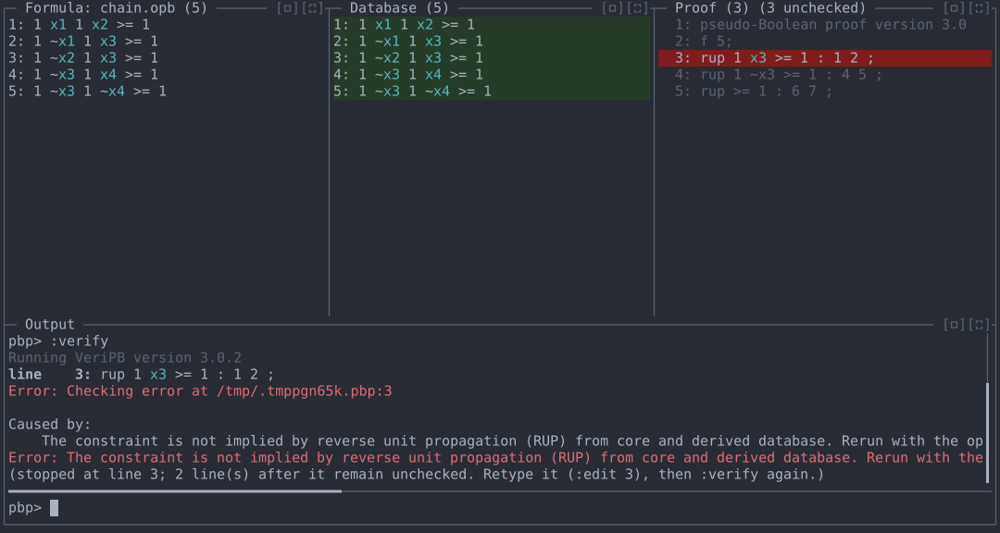
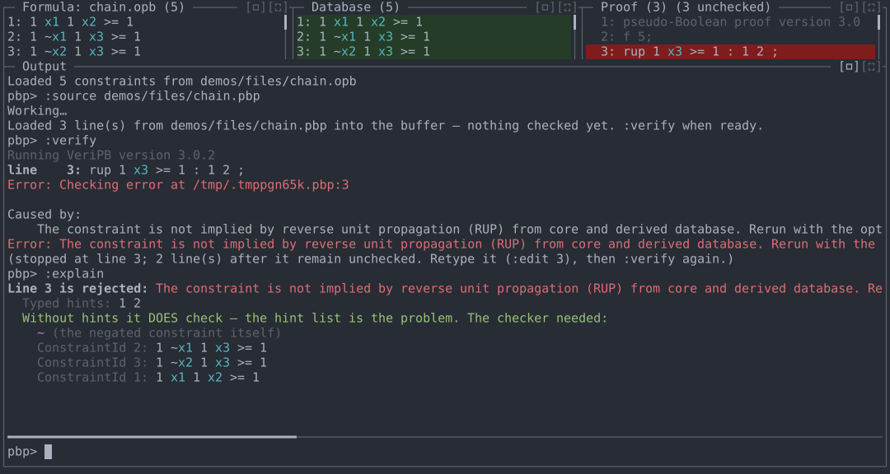
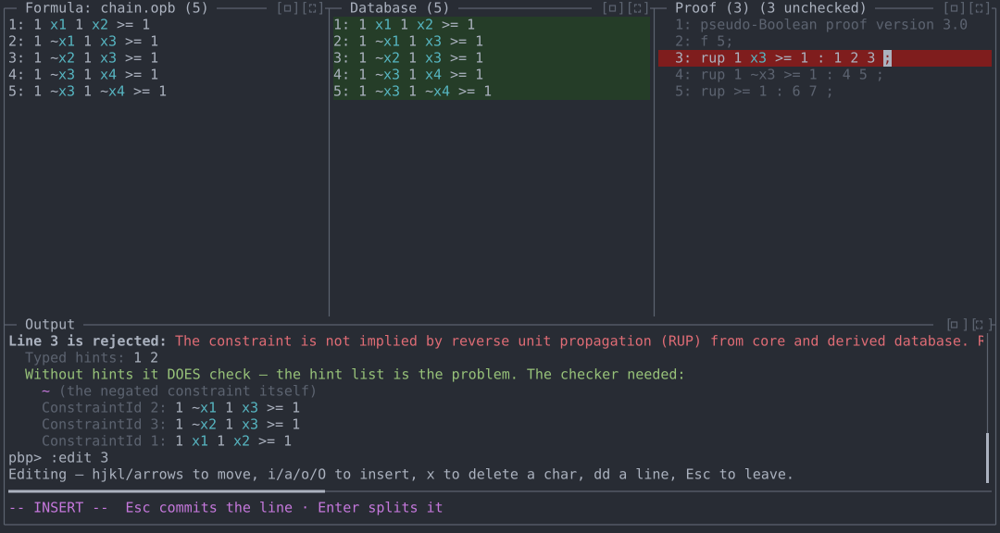
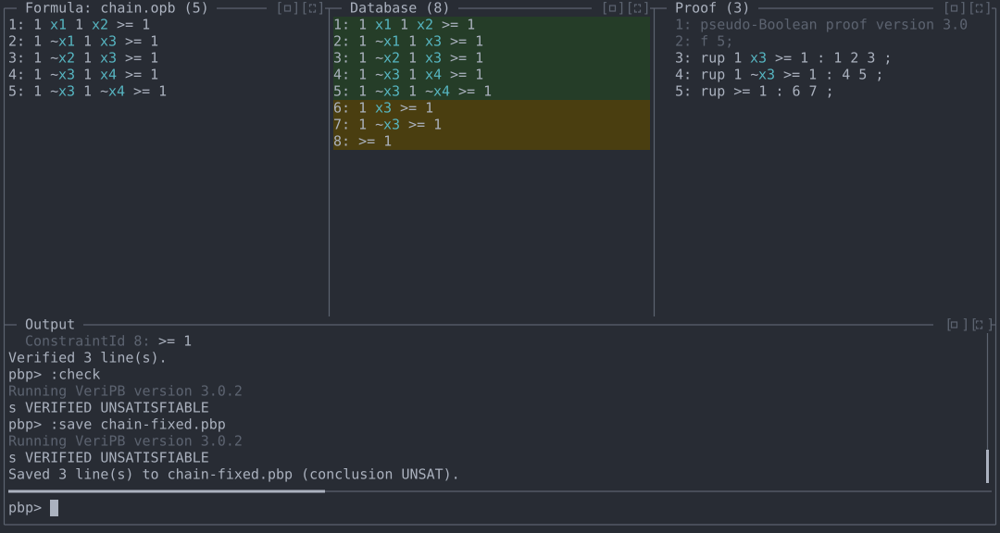

# Demo 1: Debugging a rejected `rup` step

A proof file fails to verify. The REPL locates the failing line, shows
why it fails, and lets you fix it in place and re-check, without editing
the file by hand and re-running `veripb` from the command line.

**Files:** [`files/chain.opb`](files/chain.opb),
[`files/chain.pbp`](files/chain.pbp)
**Run from:** the repository root, with `veripb` configured as in
[README.md](../README.md).

## The problem

`chain.opb` is unsatisfiable: `x1 ∨ x2`, both `x1` and `x2` imply `x3`,
and `x3` implies both `x4` and `¬x4`.

```
* #variable= 4 #constraint= 5
1 x1 1 x2 >= 1 ;
1 ~x1 1 x3 >= 1 ;
1 ~x2 1 x3 >= 1 ;
1 ~x3 1 x4 >= 1 ;
1 ~x3 1 ~x4 >= 1 ;
```

The proof derives `x3`, then `¬x3`, then the contradiction. Its first
`rup` step lists hints `1 2`, but it also needs constraint 3:

```
pseudo-Boolean proof version 3.0
f 5;
rup 1 x3 >= 1 : 1 2 ;
rup 1 ~x3 >= 1 : 4 5 ;
rup >= 1 : 6 7 ;
output NONE;
conclusion UNSAT : 8;
end pseudo-Boolean proof;
```

Running `veripb` directly reports only that line 3 is not implied by RUP.

## 1. Load the formula and the proof

```
cargo run -- demos/files/chain.opb
```

The Formula and Database panes show the five constraints with their IDs.
At the `pbp>` prompt:

```
:source demos/files/chain.pbp
```

The proof's three derivation lines appear in the Proof pane, unchecked.
The closing `output`/`conclusion`/`end` lines are left out; the REPL adds
them when needed (`:check`, `:save`).

## 2. Verify, and stop at the failing line

```
:verify
```

`:verify` checks the unchecked lines in order and stops at line 3, which
is shown on a red background in the Proof pane. Lines 4 and 5 stay in the
buffer, unchecked.



## 3. Ask why it fails

```
:explain
```

With no argument, `:explain` targets the rejected line. For a `rup` step
it re-checks the same constraint with the hint list removed. Here that
succeeds, so the constraint is RUP-implied and the hint list is wrong:
the checker's minimal set of needed hints includes constraint 3, which
the proof left out. If a typed hint ID didn't exist, `:explain` would
say so; if the constraint failed even without hints, it would say the
constraint isn't RUP-implied at all.

The screenshot below has the Output pane enlarged with its `[▭]` button.



## 4. Fix the line in place

```
:edit 3
```

This opens Vim mode on line 3. Move to the `;` (`l` or →), press `i`, and
type `3 `. Press Esc to commit the line, and Esc again to leave Vim mode.



## 5. Re-verify, conclude, and save

```
:verify
:check
:save chain-fixed.pbp
```

`:verify` checks from line 3 to the end; the Database pane gains
constraints 6–8. `:check` tries the possible conclusions against the
checked lines without closing the proof and reports
`s VERIFIED UNSATISFIABLE`. `:save` writes a complete proof with that
conclusion:



`chain-fixed.pbp` is accepted by `veripb` on its own:

```
pseudo-Boolean proof version 3.0
f 5;
rup 1 x3 >= 1 : 1 2 3 ;
rup 1 ~x3 >= 1 : 4 5 ;
rup >= 1 : 6 7 ;
output NONE;
conclusion UNSAT;
end pseudo-Boolean proof;
```

## Commands used

| Command | Purpose |
|---|---|
| `:source <file>` | Load a proof into the buffer, unchecked. |
| `:verify` | Check unchecked lines; stop at the first rejection. |
| `:explain [n]` | Explain line `n`, or the rejected line. |
| `:edit <n>` | Edit line `n` (Vim mode in the TUI). |
| `:check` | Test for a conclusion without closing the proof. |
| `:save <file>` | Write the proof with its conclusion. |
