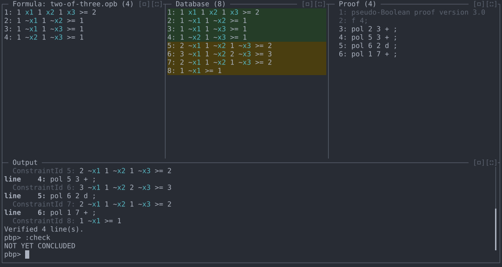
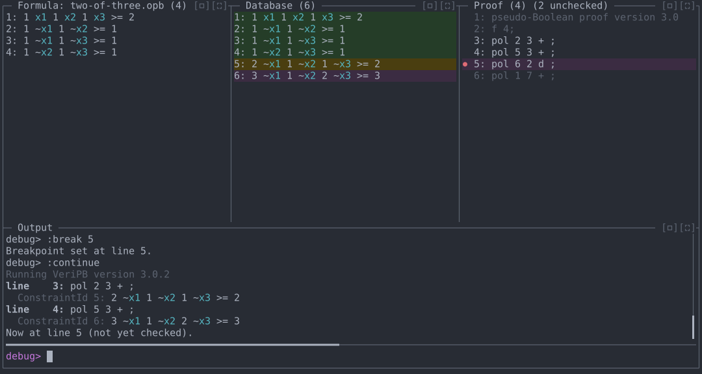
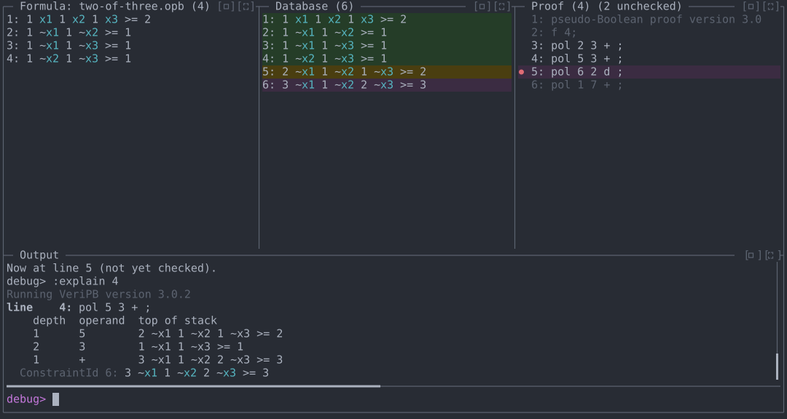
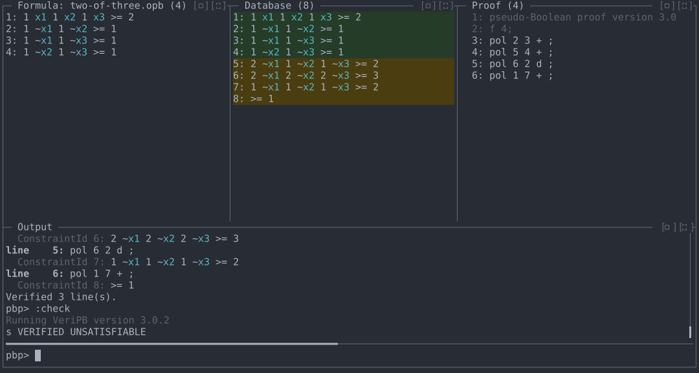

# Demo 2: Finding a wrong `pol` step

Every line of a proof is accepted, but the proof doesn't reach the
contradiction it claims. `veripb` reports only the final failure; the
REPL lets you step through the derivation, inspect the database at any
point, and see each `pol` step's arithmetic.

**Files:** [`files/two-of-three.opb`](files/two-of-three.opb),
[`files/two-of-three.pbp`](files/two-of-three.pbp)
**Run from:** the repository root, with `veripb` configured as in
[README.md](../README.md).

## The problem

`two-of-three.opb` requires at least two of `x1, x2, x3` to be true, and
forbids every pair from being true together, so it is unsatisfiable:

```
* #variable= 3 #constraint= 4
1 x1 1 x2 1 x3 >= 2 ;
1 ~x1 1 ~x2 >= 1 ;
1 ~x1 1 ~x3 >= 1 ;
1 ~x2 1 ~x3 >= 1 ;
```

The intended proof adds the three pair constraints (2, 3, 4), divides by
2 to get "at most one of `x1, x2, x3`" (`~x1 + ~x2 + ~x3 >= 2`), and adds
constraint 1 to reach `0 >= 1`. Line 4 adds constraint 3 a second time
instead of constraint 4:

```
pseudo-Boolean proof version 3.0
f 4;
pol 2 3 + ;
pol 5 3 + ;
pol 6 2 d ;
pol 1 7 + ;
output NONE;
conclusion UNSAT : 8;
end pseudo-Boolean proof;
```

Each `pol` step is still sound, so `veripb` accepts lines 3–6 and fails
only at the conclusion: "The constraint with ID 8 is not contradicting".

## 1. Load, verify, and check

```
cargo run -- demos/files/two-of-three.opb
```

```
:source demos/files/two-of-three.pbp
:verify
:check
```

All four lines verify, but `:check` reports `NOT YET CONCLUDED`. The
Database pane shows why: constraint 8 is `1 ~x1 >= 1`, not the
contradiction `>= 1`.



## 2. Step back through the proof

Constraint 7 should be `~x1 + ~x2 + ~x3 >= 2`, but its coefficients are
uneven (`2 ~x1 1 ~x2 1 ~x3`), so the mistake is at or before line 5.
Re-run the proof up to just before line 5:

```
:debug
:restart
:break 5
:continue
```

`:debug` enters stepping mode (prompt `debug>`). `:restart` marks every
line unchecked, `:break 5` sets a breakpoint (● in the Proof pane), and
`:continue` checks forward until it reaches it. The Database pane now
shows the state after line 4: constraint 6 is `3 ~x1 1 ~x2 2 ~x3 >= 3`,
where adding all three pair constraints would give `2 ~x1 2 ~x2 2 ~x3`.



## 3. See the step's arithmetic

```
:explain 4
```

For a `pol` line, `:explain` shows each operand and the constraint on
top of the stack after it. The second operand is constraint 3,
`1 ~x1 1 ~x3 >= 1`, which adds `~x1` again; it should be constraint 4,
`1 ~x2 1 ~x3 >= 1`.



Leave stepping mode:

```
:break clear
:done
```

## 4. Fix the line and re-check

```
:edit 4
```

In Vim mode, move to the `3` (`l` six times), press `x` to delete it,
then `i` and type `4`. Press Esc to commit the line and Esc again to
leave Vim mode.

```
:verify
:check
```

`:verify` re-checks lines 4–6. Constraint 6 is now
`2 ~x1 2 ~x2 2 ~x3 >= 3`, constraint 7 is `1 ~x1 1 ~x2 1 ~x3 >= 2`, and
constraint 8 is `>= 1`. `:check` reports `s VERIFIED UNSATISFIABLE`.



## Commands used

| Command | Purpose |
|---|---|
| `:check` | Test for a conclusion without closing the proof. |
| `:debug` | Enter stepping mode (`:done` leaves). |
| `:restart` | Mark every line unchecked, keeping them all. |
| `:break <n>` | Toggle a breakpoint at line `n`; `:break clear` removes all. |
| `:continue` | Check forward to the next breakpoint or rejection. |
| `:explain <n>` | For `pol`, show each operand and the running result. |
| `:edit <n>` | Edit line `n` (Vim mode in the TUI). |
