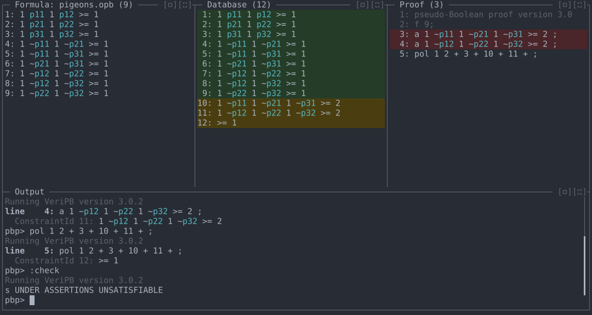
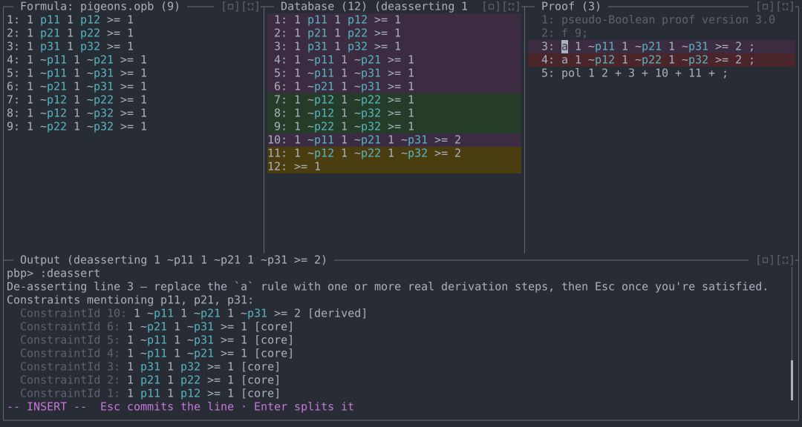
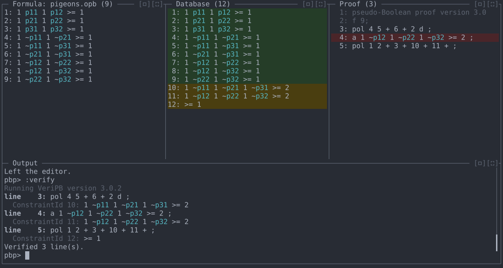
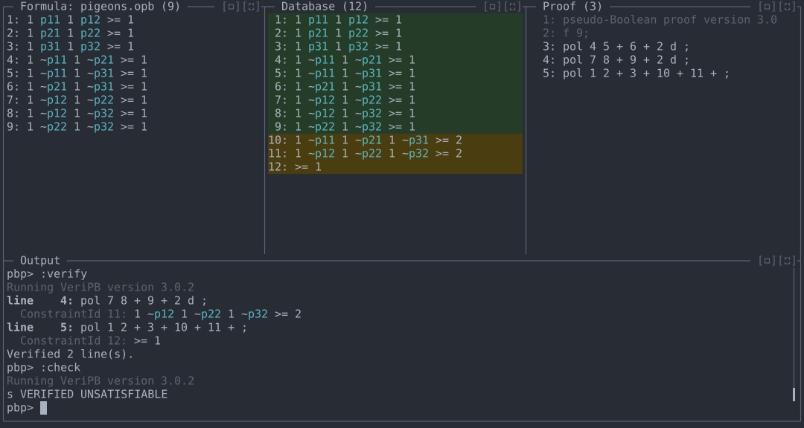

# Demo 3: Writing a proof top-down with assertions

State the lemmas a proof needs as unchecked assertions (`a` lines),
check that the conclusion follows from them, then replace each
assertion with a real derivation. The REPL shows which constraints are
relevant to each assertion as you replace it.

**Files:** [`files/pigeons.opb`](files/pigeons.opb)
**Run from:** the repository root, with `veripb` configured as in
[README.md](../README.md).

## The problem

`pigeons.opb` is the pigeonhole principle for 3 pigeons and 2 holes;
`p<i><j>` means pigeon `i` is in hole `j`:

```
* every pigeon is in a hole
1 p11 1 p12 >= 1 ;
1 p21 1 p22 >= 1 ;
1 p31 1 p32 >= 1 ;
* no two pigeons share hole 1
1 ~p11 1 ~p21 >= 1 ;
1 ~p11 1 ~p31 >= 1 ;
1 ~p21 1 ~p31 >= 1 ;
* no two pigeons share hole 2
1 ~p12 1 ~p22 >= 1 ;
1 ~p12 1 ~p32 >= 1 ;
1 ~p22 1 ~p32 >= 1 ;
```

Plan: show that each hole holds at most one pigeon
(`~p1j + ~p2j + ~p3j >= 2`); adding those two facts to the three "every
pigeon is in a hole" constraints gives `0 >= 1`.

## 1. Sketch the proof

```
cargo run -- demos/files/pigeons.opb
```

Type the two lemmas as assertions, then the final step that uses them
(constraints 10 and 11):

```
a 1 ~p11 1 ~p21 1 ~p31 >= 2 ;
a 1 ~p12 1 ~p22 1 ~p32 >= 2 ;
pol 1 2 + 3 + 10 + 11 + ;
:check
```

Each line is checked as you type it; an `a` line is accepted without a
derivation. The assertions are shown on a red background in the Proof
pane. Constraint 12 is the contradiction `>= 1`, and `:check` reports
`s UNDER ASSERTIONS UNSATISFIABLE`: the conclusion follows, provided the
assertions hold.



## 2. Replace the first assertion

```
:deassert
```

`:deassert` opens Vim Insert mode at the start of the first `a` line. It
lists the database constraints that share variables with the assertion,
most shared variables first, and highlights them in the Database pane.
Here constraints 4, 5 and 6 (the hole-1 pairs) are the ingredients:
summing them gives `2 ~p11 2 ~p21 2 ~p31 >= 3`, and dividing by 2
rounds up to `>= 2`.



Type the derivation and press Enter, which splits the line: the new
text stays on line 3 and the old assertion moves to line 4. Press Esc,
then `dd` to delete the old assertion, then Esc to leave Vim mode:

```
pol 4 5 + 6 + 2 d ;
```

```
:verify
```

The new line derives the same constraint 10 as the assertion did, so the
later lines still check. One assertion remains:



## 3. Replace the second assertion and conclude

```
:deassert
```

`:deassert` now opens the remaining `a` line. Replace it the same way
with the hole-2 pairs (constraints 7, 8, 9):

```
pol 7 8 + 9 + 2 d ;
```

```
:verify
:check
```

No assertions remain, and `:check` reports `s VERIFIED UNSATISFIABLE`.



## Commands used

| Command | Purpose |
|---|---|
| `a <constraint> ;` | Add a constraint without a derivation (an assertion). |
| `:check` | Test for a conclusion; `UNDER ASSERTIONS` while assertions remain. |
| `:deassert [n]` | Replace the first `a` line, or line `n`, with derivation steps; lists and highlights related constraints. |
| `:verify` | Check unchecked lines. |
