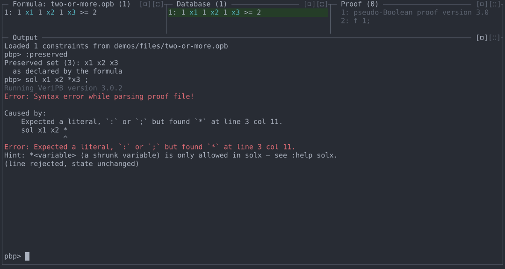
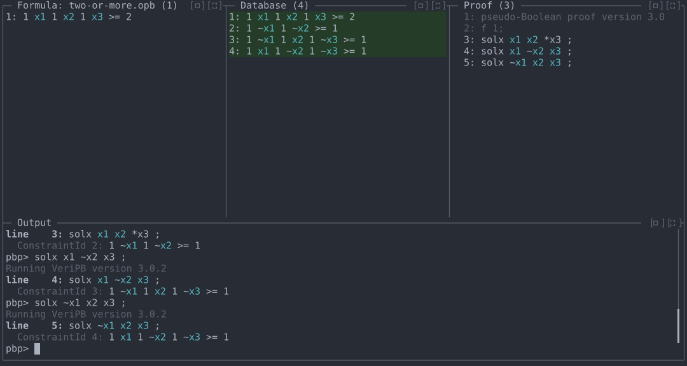
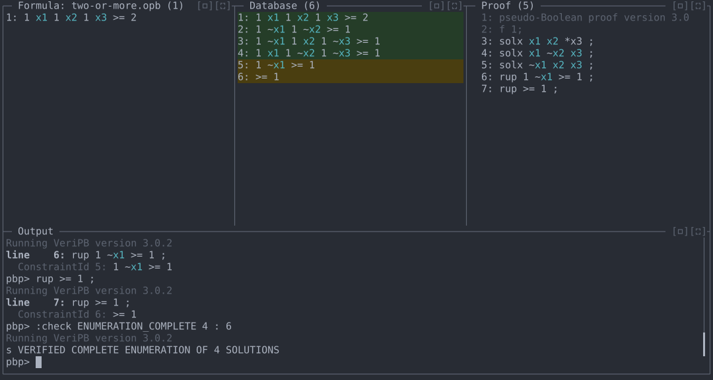

# Demo 4: Enumerating solutions with `solx` and shrunk variables

Log every solution of a formula, projected onto its preserved
variables, and certify that the enumeration is complete. A shrunk
variable (`*x` in `solx`) logs a whole cube of solutions in one step.

**Files:** [`files/two-or-more.opb`](files/two-or-more.opb)
**Run from:** the repository root, with `veripb` configured as in
[README.md](../README.md).

## The problem

`two-or-more.opb` requires at least two of `x1, x2, x3` to be true, and
declares all three as the preserved set, so its projected solutions are
`110`, `101`, `011` and `111`:

```
* #variable= 3 #constraint= 1
preserved: x1 x2 x3 ;
1 x1 1 x2 1 x3 >= 2 ;
```

`solx` logs a solution and adds a clause excluding it (over the preserved
variables). With `x1 = x2 = 1` the constraint holds whatever `x3` is, so
`110` and `111` can be logged together by shrinking `x3`.

## 1. Check the preserved set

```
cargo run -- demos/files/two-or-more.opb
```

```
:preserved
```

`:preserved` shows the current preserved set, and whether a
`preserved_add`/`preserved_rm` step has changed it since the formula
declared it.

Shrinking is only allowed in `solx`. Typing it in `sol` is a syntax
error, and the REPL adds a hint:

```
sol x1 x2 *x3 ;
```

The screenshot below has the Output pane enlarged with its `[▭]` button.



## 2. Log the solutions

```
solx x1 x2 *x3 ;
solx x1 ~x2 x3 ;
solx ~x1 x2 x3 ;
```

Each `solx` is checked as you type it and adds its excluding clause to
the database:

| Line | Logs | Adds |
|---|---|---|
| `solx x1 x2 *x3 ;` | `110`, `111` | `1 ~x1 1 ~x2 >= 1` (no `x3`: it is shrunk) |
| `solx x1 ~x2 x3 ;` | `101` | `1 ~x1 1 x2 1 ~x3 >= 1` |
| `solx ~x1 x2 x3 ;` | `011` | `1 x1 1 ~x2 1 ~x3 >= 1` |



## 3. Show there are no more solutions

With every solution excluded, the database is contradictory, but not by
unit propagation alone; `rup >= 1 ;` on its own is rejected. Derive `¬x1`
first (assuming `x1` forces `x2 = 0`, then `x3 = 0`, violating constraint
1), then the contradiction:

```
rup 1 ~x1 >= 1 ;
rup >= 1 ;
```

## 4. Certify the enumeration

```
:check ENUMERATION_COMPLETE 4 : 6
```

`ENUMERATION_COMPLETE n : id` claims exactly `n` projected solutions
were logged and that constraint `id` is a contradiction. The shrunk
`solx` counts as two solutions, so the three `solx` lines give four, and
`veripb` reports `s VERIFIED COMPLETE ENUMERATION OF 4 SOLUTIONS`.
Claiming 3 is rejected. (Bare `:check` reports only
`s VERIFIED SATISFIABLE`.)



## Commands used

| Command | Purpose |
|---|---|
| `:preserved` | Show the current preserved set. |
| `solx <literal\|*variable> ... ;` | Log a solution (a cube, with shrunk variables) and exclude it. |
| `:check <conclusion>` | Test a specific conclusion without closing the proof. |
| `:help solx` | Syntax and conditions for `solx` and shrinking. |
